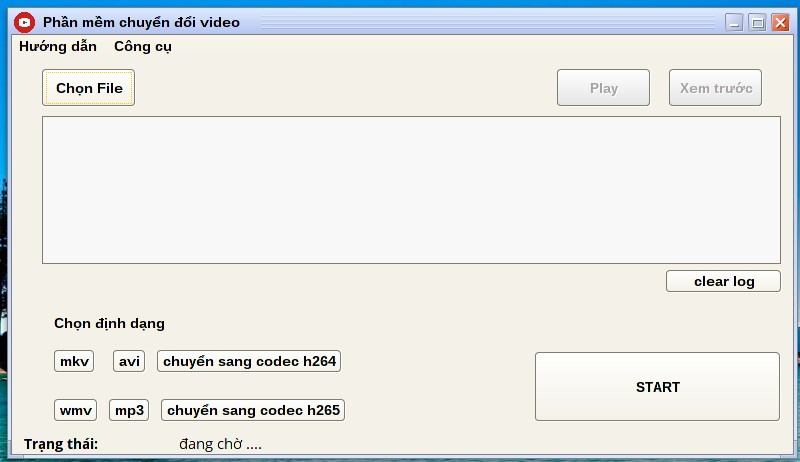

##FFmpegGui2 - graphical interface of FFmpeg using Java swing as a gui frontend, aim to provide easy to use interface with common and useful features

__Please note: This project is currently in alphal state and support Linux only, with FFmpeg required to be installed on your system, the next update will make it working with Windows too.__

### Installation:

Comming soon ...

### Screen shots:

### Credit:

__Team 8 - Uneti__